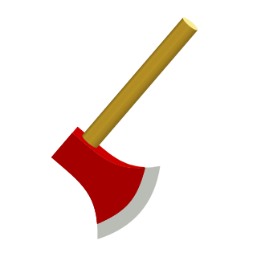

******************************************
*Lumberjack*: from ``TTree`` to histograms
******************************************

**Lumberjack** is a tool for processing large amounts of columnar data stored in ROOT ``TTree``
objects. For analysis purposes, these data are typically processed to obtain simpler
analysis-level objects such as histograms or profile histograms ("profiles" for short).

In principle, this is achievable using the "traditional" interfaces provided by
the ``TTree`` object directly, such as ``TTree::Draw()``, or by manually looping
through the ``TTree``.

However, these approaches have their disadvantages. ``TTree::Draw()`` has the inherent
limitation of requiring a loop to be executed every time a histogram is filled, while
manually implementing the loop implies writing a lot of "boilerplate" C++ and/or Python
code, which can be tedious and error-prone.

In addition, both these approaches often results in generic code being mixed with
analysis-specific code and metadata (binnings, threshold values for filters, etc.),
which can prove difficult to debug and maintain.

A much more flexible interface is provided by ``RDataFrame``, a recent addition to ROOT,
which takes a declarative approach towards processing ``TTree`` objects. This means that
the entire workflow is specified **before** looping through the ``TTree``. Once
everything is set up, the main ``TTree`` loop is executed only once, filling all the
requested histograms in parallel. This makes ``TTree`` processing with ``RDataFrames``
potentially very efficient, especially for workflows requiring a large number of
histograms.

*Lumberjack* is built on top of the ``RDataFrame`` interface and aims to provide users
with a simple but powerful interface for configuring and running such workflows.

Configuration
=============

A configuration module supplies *Lumberjack* with all the information it needs to produce
the requested outputs. This includes things like:

* the names of the variables stored in the input ``TTree``
* how to bin these variables when creating histograms
* what selection filters to apply to the sample
* how to split the sample into subsamples

This information is provided via *Python* dictionaries or lists and is provided by each
configuration module via a series of module-level variables. These content and structure
of these variables is covered in the following subsections. The following table provides
an overview of these variables and gives a short summary of their contents:

.. table::
    :widths: 20, 80

    +-----------------+---------------------------------------------------+
    | Variable name   | Contains                                          |
    +=================+===================================================+
    | ``QUANTITIES``  | names and binnings of quantities to be filled     |
    |                 | into histograms. Can be branches of the input     |
    |                 | ``TTree`` or expressions involving them.          |
    +-----------------+---------------------------------------------------+
    | ``DEFINES``     | named expressions involving ``TTree`` branches.   |
    |                 | Can be used as "shortcuts" then defining          |
    |                 | quantities.                                       |
    +-----------------+---------------------------------------------------+
    | ``ROOT_MACROS`` | C++ code passed to the global ROOT interpreter.   |
    |                 | Functions defined here can be used expressions    |
    |                 | when defining quantities.                         |
    +-----------------+---------------------------------------------------+
    | ``SELECTIONS``  | named groups of filter expressions to apply to    |
    |                 | ``TTree`` before further processing.              |
    +-----------------+---------------------------------------------------+
    | ``SPLITTINGS``  | named "recipes" for splitting the sample into     |
    |                 | subsamples based on the value of a                |
    |                 | variable/expression.                              |
    +-----------------+---------------------------------------------------+
    | ``TASKS``       | named "recipes" for commonly performed tasks.     |
    |                 | A task consists of one or more global selections  |
    |                 | one or more splitting recipes, and a list of      |
    |                 | requested output quantities                       |
    +-----------------+---------------------------------------------------+

.. note::
    Variables must be made available at the top level of a configuration module. That is,
    they must be importable via :code:`from Lumberjack.cfg.config_module import VARIABLE`

``QUANTITIES``: what should *Lumberjack* output contain?
--------------------------------------------------------

A **quantity** is a ``TTree`` branch (or an expression involving ``TTree``
branches) which is meant to be filled into a histogram or profile histogram.
Quantities always have an associated **binning**, indicating the bin
structure to be used when creating the corresponding histograms.

Quantities are represented in *Lumberjack* by their own Python objects
containing the following properties:

* **name**: (*string*), uniquely identifies a quantity. The name of output
  histograms involving this quantity will contain this string
* **expression**: (*string*), *optional*, formula for calculating the quantity value
  from ``TTree`` branches. If this is not given, a branch called **name** is assumed
  to exist and will be used.
* **binning**: (*list*) of numeric values, indicating the bin edges. Must be sorted
  in ascending order

For more information, consult the API documentation for
:py:class:`~Lumberjack.Quantity`.

Every quantity has an associated **binning**, that is, an array of `float`
values, sorted in *ascending* order, indicating the bin edges. Values
less than the first bin edge or greater than the last bin edge are counted
as *underflows* or *overflows* in the resulting ROOT histograms.

.. note::
    If the same ``TTree`` branch should be filled into histograms with different
    binnings, then a separate quantity must be defined for each binning.
    The ``expression`` should be set to the name of the ``TTree`` branch.`

The configuration variable ``QUANTITIES`` is mandatory and contains the
definition of all quantities that *Lumberjack* can work with. It is a
*Python* dictionary.

The top-level keys correspond to the different **input types**.
Different input types (e.g. data for different measurement channels,
Monte Carlo simulation samples, etc.) can contain different quantities,
so this layer exists to allow users to define input-type specific
quantities.

The names of the input types can be chosen freely. For quantities which
are defined in all input types, a special input type called ``global``
exists. The ``QUANTITIES`` dictionary must always contain a ``global``
key, even if it is empty.

Each input type maps to an inner dictionary which contains the definitions
of quantities available for that input type. This inner dictionary maps
the names of quantities to instances of the :py:class:`~Lumberjack.Quantity`
class, which

.. note::
    In virtually all cases, the ``name`` property of a :py:class:`~Lumberjack.Quantity`
    object should be identical to the *dictionary key* in ``QUANTITIES`` that maps to it.
    While this is not enforced, it is good practice to ensure that this is always the case.
    *Lumberjack* uses the ``name`` property when constructing the names of histograms in the output file,
    and the *dictionary key* when looking up a quantity requested by the user.

.. note::
    If the same key is present in the `global` dictionary **and** the dictionary for a particular
    input type, then the `global` quantity definition is **replaced** by input-type-specific one.

Below is an example of a valid ``QUANTITIES`` definition:

.. code-block:: python

    from Lumberjack import Quantity

    ...

    QUANTITIES = {

      # mandatory: these quantities are defined for all input types
      'global': {

        # assuming there is a TTree branch called 'quantityA'
        'quantityA': Quantity(
          name='quantityA',
          binning=[0, 5, 10, 100, 5000]
        ),

        # same TTree branch, different binning
        'quantityA_narrowBins': Quantity(
          name='quantityA_narrowBins',
          expression='quantityA',
          binning=[0, 2.5, 5, 7.5, 10, 50, 100, 300, 500, 5000]
        ),

        # apply an expression to a TTree branch
        'abs_quantityB': Quantity(
          name='abs_quantityB',
          expression='abs(abs_quantityB)',  # expression interpreted by ROOT
          binning=[0, 1, 2, 3]
        ),

      }

      # quantities only defined for a special input type
      'my_special_input_type': {

        # this TTree branch only exists in a special sample type
        'mySpecialQuantity': Quantity(
          name='mySpecialQuantity',
          binning=[0, 5, 10, 100, 5000]
        ),

      }

    }

``DEFINES``: shortcuts for often-used expressions
-------------------------------------------------

It can happen that a variable is not directly stored in a ``TTree`` branch
but has to be calculated for every entry. Often, these expressions are
not full-blown quantities themselves (i.e. they do not need to be filled
into histograms), but are only used as "shortcuts" when defining quantities.

To avoid specifying these variables in ``QUANTITIES``, which would require
specifying an (unneeded) binning, they are specified in a separate
configuration variable: ``DEFINES``.

The ``DEFINES`` configuration variable is a Python dictionary and has
a structure similar to the ``QUANTITIES`` variable. The top-level
keys must correspond to the different input types defined in the
``QUANTITIES`` variable and must map to inner dictionaries
specifying the expressions to be defined.

Unlike for quantities, however, there is no dedicated ``Define`` object.
Instead, an expression is simply defined by adding a *key*--*value* pair
to the inner dictionary. The *key* is the name given to the expression
and the *value* is simply the expression string.

The above functionality is provided by ROOT's ``RDataFrame`` interface.
via the ``Define`` call. For each *key*--*value* pair, a ``Define(key, value)``
call will be issued.

.. note::
    For quantities that have an ``expression`` property which does not
    coincide with their ``name``, a ``Define`` call will already
    be issued when initializing the ``RDataFrame``, so in that case
    there is no need to add an entry for this in ``DEFINES``.

Here is an example of a ``DEFINES`` variable:

.. code-block:: python

    DEFINES = {

      'global': {

        # calculate radius as a function of x and y
        'radius': 'TMath::Sqrt(x*x + y*y)',  # can use ROOT's function library

      },

      'special_3d_sample': {

        # calculate radius as a function of x, y and z
        'radius': 'TMath::Sqrt(x*x + y*y + z*z)',  # overrides `global` definition above

      }

    }

.. note::
    Since dictionary keys are not ordered, there is no guarantee that the
    ``Define`` calls will be issued in the same order as they appear in
    the configuration file. So the dictionary keys should not be used for
    any expression defined *in the same dictionary*.

    There *is*, however, a guarantee that all ``global`` defines will be
    made before the ones specific to input-type, so input-type-specific
    expressions may contain globally-defined variables.

    If ordering is important, it may be possible to use Python ``OrderedDict``\ s
    instead of plain dictionaries, but this has not been tested.

``ROOT_MACROS``: C++ code to be executed in the ROOT interpreter
----------------------------------------------------------------

The underlying mechanism used by ROOT's ``RDataFrame`` to allow simple
strings to be interpreted as expressions works by translating these
expressions into C++ code via ROOT's internal JIT (just-in-time
compilation) mechanism.

For simple expressions, this is very convenient, but for cases when
more complicated functions of ``TTree`` variables need to be evaluated,
it is not feasible to provide these as strings. ROOT's ``RDataFrame``
interface, however, allows applying arbitrary C++ functions to ``TTree`` data.

The configuration variable ``ROOT_MACROS`` can be used for this purpose.
It is a string containing C++ code which will be passed as-is to the
ROOT global interpreter. Any C++ functions defined in this way can
then be used in ``QUANTITIES`` and ``DEFINES`` just as any other
function.

Here is an example which defines a C++ function called ``isMandelbrot``.
This uses a ``while`` loop to determine whether a point in the complex
plane is (roughly) in the
`Mandelbrot set <https://en.wikipedia.org/wiki/Mandelbrot_set>`_:

.. code-block:: python

    ROOT_MACROS = """

    #include <complex>

    /* determine whether point belongs to Mandelbrot set */
    bool isMandelbrot(const double& realPart, const double& imagPart) {

        std::complex<double> c(realPart, imagPart);
        std::complex<double> z(0, 0);

        unsigned int nIterations = 0;
        while (std::abs(z) < 2.0 && nIterations < 10000) {
            z = z*z + c;
            ++nIterations;
        }

        if (nIterations == 10000)
            return true;
        else
            return false;

    }
    """

Note the triple-quoted string, which is needed for multi-line strings in Python.
Once defined in ``ROOT_MACROS`` as above, the function can be used
in ``DEFINES``:

.. code-block:: python
    :emphasize-lines: 7-9

    DEFINES = {

      'global': {

        ...

        # check if entry is in the Mandelbrot set using
        # ``TTree`` branches 'realPart' and 'imagPart' as inputs
        'isMandelbrot': 'isMandelbrot(realPart, imagPart)'
      }
      ...
    }

Instead of using a triple-quoted string for ``ROOT_MACROS``, all C++ code
can be put into a separate file and loaded directly into the variable using
the I/O tools provided by Python:

.. code-block:: python

    import os

    ...

    # put the contents of a file in ROOT_MACROS
    _root_macro_file_path = os.path.join(os.path.dirname(__file__), "root_macros.C")
    with open(_root_macro_file_path, 'r') as _root_macro_file:
        ROOT_MACROS = ''.join(_root_macro_file.readlines())

``SELECTIONS``: named groups of cuts to be applied before splitting
-------------------------------------------------------------------

An important operation when processing n-tuple data is the application
of **filters**, that is, accepting only those entries for which the
n-tuple values satisfy certain conditions, and rejecting the rest.

A typical use for filters in HEP data analyses is in implementing the
so-called *event selection*. For events stored as n-tuples in a
``TTree``, this translates to applying a group of several cuts on
``TTree`` branches or functions thereof before further processing.

In *Lumberjack*, users can define multiple such selections which can
be applied to the input ``TTree``.

A **selection** has a unique name and consists of a **list** of boolean
filter expressions which will evaluated for every ``TTree`` entry. An
entry is rejected if one of the expressions evaluates to ``False`` (i.e.
the expressions are joined via a logical ``AND``).

Selections are defined in the  ``SELECTIONS`` configuration variable.
It is a Python dictionary which maps the selection name to the list of
filter expressions.

Here is an example of a ``SELECTIONS`` specification:

.. code-block:: python

    SELECTIONS = {

      'mainSelection' : [
        'varA > 100',
        'abs(varB) < 2.4',
        'varA/varC < 0.3',
      ],

      'additionalSelection' : [
        'varD == 1',
      ]

    }

``SPLITTINGS``: how should the TTree be split?
----------------------------------------------

An important task for analyses consists in splitting a large sample
into several subsamples (or "regions") based on the values of one or
more variables.

In *Lumberjack*, this is specified by the ``SPLITTINGS`` configuration
variable.

The ``SPLITTINGS`` configuration variable consists of a series of
nested Python dictionaries, with three levels structured as follows:

* the top-level dictionary
  consists of *key*--*value* pairs where the
  *key* is the **name** of the splitting and the
  *value* (the *intermediate* dictionary) contains the specification for that particular splitting
* the *intermediate* dictionary
  describes the structure of the cuts to be applied and
  consists of *key*--*value* pairs where the
  *keys* are strings containing "cut descriptions" and the
  *values* (the *innermost* dictionaries) contain the cuts that should be applied
* the *innermost* dictionaries
  consist of *key*--*value* pairs where the
  *keys* are the variables to cut on and the
  *values* specify the variable values (or range of values)

In the following example, two splittings of the sample based on the
values of variables ``var_A`` and ``sign_B`` are declared:

.. code-block:: python

    SPLITTINGS = {

        # split into multiple regions of A
        'region_A' : {
            'A_from_0_to_1':    dict(var_A=(0, 1)),     # implies "0<=var_A && var_A<1"
            'A_from_1_to_2':    dict(var_A=(1, 2)),
            'A_greater_than_2': dict(var_A=(2, 1000)),
        },

        # split into two parts depending on the sign of B
        'sign_B' : {
            'B_negative': dict(sign_B=-1),
            'B_positive': dict(sign_B=1),
        },

    }

Note that any variable appearing as a key in the innermost dictionaries
(``sign_B`` and ``var_A`` in the above example) must either be a
``TTree`` branch or a named expression specified in ``DEFINES``.

``TASKS``: what should be done?
-------------------------------

The main unit of work in *Lumberjack* is the **task**. A task is
like a "blueprint" for a particular workflow and tells *Lumberjack*
which *splittings* to use when splitting the sample and what
analysis-level objects (histograms and/or profiles) should be filled.

When running *Lumberjack*, each task produces *exactly one* output ROOT
file. The structure of this ROOT file reflects the chosen
splitting(s) and analysis-level objects and is described in more
detail :ref:`below <lumberjack-output>`.

Tasks are specified in the ``TASKS`` configuration variable, which is
a Python dictionary that maps the task **name** to an inner dictionary
containing the task specification. The inner dictionary contains the
following keys:

* **splittings**: a *list* of strings corresponding to top-level,
  indicating how the sample should be split into subsamples
* **histograms**: a *list* of strings specifying the histograms
  to be filled for each subsample
* **profiles**: a *list* of strings specifying the profile
  histograms to be filled for each subsample

The strings given in **splittings** must be keys of the ``SPLITTINGS``
configuration dictionary. If multiple splitting keys are specified,
the sample will be split according to the **outer product** of the
corresponding splitting specifications. This means that the sample
is first split according to the first splitting key, then each
of the subsamples created is split according to the second key, and so
on.

The strings given in **histograms** and **profiles** specify which
quantities should be filled into the object. If multidimensional
histograms or profiles are desired, the quantities to be filled on
the ``x``, ``y`` (and optionally ``z``) axes must be provided and
separated by a colon (``:``).

.. note::
  The quantities for multidimensional histograms and profiles should
  be given in the order ``x:y[:z]``. This is different from the
  convention used by ROOT's ``TTree::Draw()``, which uses
  ``y:x``.

Weighted histograms can be requested by appending ``@`` to the histogram
of profile specification, followed by the variable to be used as a weight.

If one of **histograms** or **profiles** is not specified, no objects of
that type will be filled. If both are empty, nothing is done.

.. _lumberjack-tasks-example:

The following example shows how to configure a task which splits the
input sample according to the outer product of two splittings and
creates several analysis-level objects of different types:

.. code-block:: python

    TASKS = {

      ...

        'MyTask' : {

            # split sample into subsamples according to these entries in SPLITTINGS:
            'splittings': [
              'region_A',
              'sign_B'
            ],

            # for each subsample, produce the following histograms
            'histograms': [
                "my_quantity_1",                # 1D histogram
                "my_quantity_2@my_weight",      # 1D histogram with weights
                "my_quantity_1:my_quantity_2"   # 2D histogram ("x:y")
            ],

            # for each subsample, produce the following profiles
            'profiles': [
                "my_quantity_1:my_quantity_2"   # profile histogram ("x:y")
            ]

        },

    }

Running *Lumberjack* from the command line
==========================================

Once a configuration module is created (as described above),
*Lumberjack* can be run from the command line by executing the
``lumberjack.py`` script. The flags passed to the script will
determine which configuration module to load, what ROOT file and
``TTree`` to use as an input, and various other options.

The command-line interface offers two sub-commands: **task** and
**freestyle**. The former is used to run tasks, as configured
in the ``TASKS`` configuration variable, while the latter allows users
to specify the run parameters (splittings, requested histograms/profiles)
directly on the command-line.

The following lines show an example of how to run the **task** subcommand:

.. code-block:: bash

    $> lumberjack.py
          --analysis    "my_analysis"         # name of Python config module
          --input-file  "input_file.root"     # name of ROOT file to use as input
          --input-type  "data"                # type of input (must be a key of
                                              # QUANTITIES and DEFINES)
          --tree        "path/to/ttree"       # path to TTree in ROOT file
          --selections  "my_main_selection"   # name of selection as defined in SELECTIONS
          --jobs        10                    # use 10 threads
          --log                               # create log file
          --progress                          # show progress bar
          task "MyTask" "MyTask2"             # run these tasks
            --output-file-suffix "mySuffix"   # suffix to append to output filename

Multiple tasks can be run during a single *Lumberjack* run. The output
of each task will be stored to ROOT files (one per task). The ROOT files
contain the task name and a user-specified suffix (if any).
In the above example, two files called ``MyTask_mySuffix.root`` and
``MyTask2_mySuffix.root`` will be created.

Below, an example is shown for the **freestyle** subcommand:

.. code-block:: bash

    $> lumberjack.py
          --analysis    "my_analysis"        # name of Python config module
          --input-file  "input_file.root"    # name of ROOT file to use as input
          --input-type  "data"               # type of input (must be a key of
                                             # QUANTITIES and DEFINES)
          --tree        "path/to/ttree"      # path to TTree in ROOT file
          --selections  "my_main_selection"  # name of selection as defined in SELECTIONS
          --jobs        10                   # use 10 threads
          --log --progress                   # create log file
          freestyle                          # no task, but specify parameters manually
            "my_splitting_level_1"           # split sample using these SPLITTINGS
            "my_splitting_level_2"           # (in this order)
            --histograms  "my_quantity_1"                # 1D histogram
                          "my_quantity_2@my_weight"      # 1D histogram with weight
                          "my_quantity_1:my_quantity_2"  # 2D histogram ("x:y")
            --profiles    "my_quantity_1:my_quantity_2"  # profile histogram ("x:y")
            --output-file "MyOutputFile.root"

Usage instructions can be obtained by running ``lumberjack.py --help`` on
the command-line. Running ``lumberjack.py -a "my_analysis" --help`` will
provide help using the information defined in the configuration module
``my_analysis``.

.. _lumberjack-output:

Output
======

The output ROOT file will contain all requested objects for every combination of
splitting regions. This is achieved by placing the objects into a nested directory
structure which reflects the splitting specification.

As an example, consider the following splitting specification:

.. code-block:: python

    SPLITTINGS = {
        'region_A' : {
            'A_from_0_to_1':    dict(var_A=(0, 1)),     # -> "0<=var_A && var_A<1"
            'A_from_1_to_2':    dict(var_A=(1, 2)),
            'A_greater_than_2': dict(var_A=(2, 1000)),
        },
        'sign_B' : {
            'B_negative': dict(sign_B=-1),
            'B_positive': dict(sign_B=1),
        },
    }

The above configuration specifies how to split sample into different regions,
depending of the values of the variables ``var_A`` and ``sign_B``.

If *Lumberjack* is run with the splittings specified as ``"region_A" "sign_B"``,
this will result in the following directory structure:

.. code-block:: lumberjack_output_structure

    (root directory)
     ├── A_from_0_to_1/
     │   ├── B_negative/
     │   └── B_positive/
     ├── A_from_1_to_2/
     │   ├── B_negative/
     │   └── B_positive/
     └── A_greater_than_2/
         ├── B_negative/
         └── B_positive/

Note that the ordering is important. Running with ``"sign_B" "region_A"``
instead of ``"region_A" "sign_B"`` will result in the following directory
structure:

.. code-block:: lumberjack_output_structure

    (root directory)
     ├── B_negative/
     │   ├── A_from_0_to_1/
     │   ├── A_from_1_to_2/
     │   └── A_greater_than_2/
     └── B_positive/
         ├── A_from_0_to_1/
         ├── A_from_1_to_2/
         └── A_greater_than_2/

Each "leaf" directory will contain the requested objects and will have
the exact same structure, which will depend on the types of objects requested/

To illustrate this, consider the following Lumberjack run. It uses
splittings defined above and requests a number of objects of different
types:

.. code-block:: bash

    $> lumberjack.py
          ...
          freestyle
            "region_A"
            "sign_B"
            --histograms "my_quantity_1"                # 1D histogram
                         "my_quantity_2@my_weight"      # 1D histogram with weight
                         "my_quantity_1:my_quantity_2"  # 2D histogram ("x:y")
            --profiles   "my_quantity_1:my_quantity_2"  # profile histogram ("x:y")

This is the output structure:

.. code-block:: lumberjack_output_structure

    (root directory)
     ├── B_negative/
     ┆   ├── A_from_0_to_1/
     ┆   ┆   ├── h_my_quantity_1            # unweighted 1D histogram
     ┆   ┆   ├── h_my_quantity_2_my_weight  # weighted 1D histogram
     ┆   ┆   └── my_quantity_2/             # subdirectory for objects involving `my_quantity_2`
     ┆   ┆       ├── h2d_my_quantity_1      # 2D histogram
     ┆   ┆       └── p_my_quantity_1        # profile histogram

Inside the directories which originate from the splitting specification,
the output objects are further organized into subdirectories based on
their **dimensionality**:

* objects with a quantity on the **x axis only**
  are placed directly inside the splitting directory
* objects with an additional quantity on the **y axis**
  (e.g. profile histograms or 2D histograms)
  are placed one level down
  inside a directory whose name coincides with the *y* quantity
* objects with an additional quantity on the **z and y axes**
  (e.g. 2D profile histograms or 3D histograms)
  are placed two levels down
  inside directories whose names coincide with the *z* and *y* quantities,
  in that order

Note that the object name itself only contains the quantity represented
on the *x* axis (and, for weighted histograms, the name of the weight).
