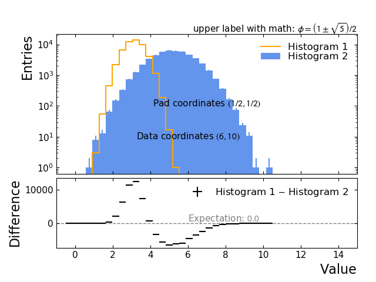
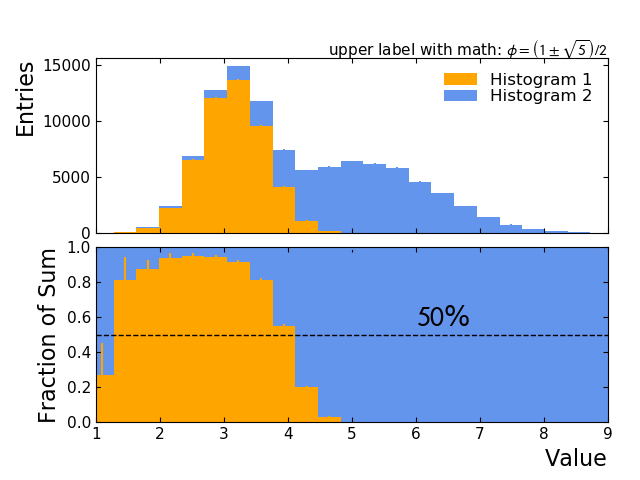
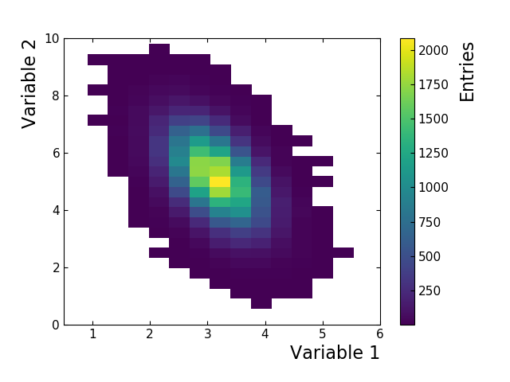

.. _palisade-examples:

*PlotProcessor* examples
========================

Putting together the features offered by the *PlotProcessor* allows the creation
of plots for a very diverse range of use-cases. Below are a few examples of
*PlotProcessor* outputs together with the full configurations used to generated
them.

Example 1: two histograms and difference
----------------------------------------

A common use for the bottom pad is to show the relation between objects
drawn in the top pad, such as ratios or differences. The example below
demonstrates how to create a two-pad layout using the ``pads``
key in the *figure configuration* and assign plots to pads using the
``pad`` key in the *plot configuration*, as well as a few other
features described above.

  Example plot demonstrating a two-pad layout

.. bootstrap_collapsible::
    :control_type: link
    :control_text: full config

    .. literalinclude:: assets/demonstration_plot.py
        :language: python

Example 2: stacked histograms and fraction of total
---------------------------------------------------

Histograms with the same binning can be stacked on top of each other by
providing a ``stack`` keyword in the corresponding subplot
configuration. All subplots that are plotted in the same pad and have
the same ``stack`` will be stacked.

  Example plot deomnstrating stacking

.. bootstrap_collapsible::
    :control_type: link
    :control_text: full config

    .. literalinclude:: assets/demonstration_plot_2.py
        :language: python

Example 3: plot of 2D histogram using a colormap
------------------------------------------------

Two-dimensional histograms can be plotted by representing the bins as
colored patches in the *x*--*y* plane. The bin value will be mapped to a
continuous sequence of colors called a *colormap*.

The *matplotlib* library supports plotting two-dimensional histograms
via the plot method ``pcolormesh``. The *colormap* can be set
via the ``cmap`` keyword.

  Two-dimensional histogram plotted using ``pcolormesh``.

.. bootstrap_collapsible::
    :control_type: link
    :control_text: full config

    .. literalinclude:: assets/demonstration_plot_3.py
        :language: python

.. todo::

    *Add more examples.*
