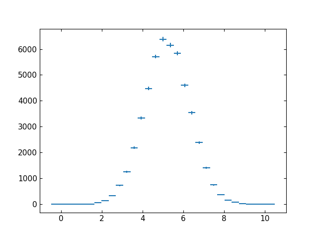

**************************************
*Palisade*: from histograms to results
**************************************

.. image:: assets/palisade_logo.svg
   :width: 96px
   :height: 96px
   :alt: Palisade logo
   :align: left

*Palisade* is a powerful tool for processing ROOT files containing
analysis-level objects such as histograms and profile histograms.
In particular, it can be used to further process and refine the
ROOT files produced by *Lumberjack*.

*Palisade* offers:

* a simple Pythonic interface for retrieving objects from ROOT files

* in-memory caching of retrieved objects to minimize unnecessary
  disk access

* the ability to perform operations involving the retrieved objects,
  ranging from simple arithmetic to arbitrary user-supplied Python code

* tools for defining parameterized tasks involving these operations

* the ability to dispatch parameterized tasks on user-defined
  multidimensional parameter spaces

* a flexible command-line interface for running tasks

* a modular structure allowing for easy extension of the existing
  interfaces and structures to cover custom use-cases

.. note::

    This chapter is still a work in progress, so some information may
    be missing. When in doubt, make sure to also check the
    :ref:`API documentation <api-palisade>`.

Processors
==========

*Palisade* is a Python module that offers a number of different
**processors** (currently only two), each designed for a particular
type of task. A processor is initialized with a **configuration** (in
the form of a Python dictionary) and an **output directory** for
writing any output files generated by the task.

Running *Palisade* is as straightforward as importing the processor
object, instantiating it with a particular configuration and executing
the :py:meth:`run` method:

.. code:: python

    # import a processing module from Palisade (e.g. AnalyzeProcessor)
    from Palisade import AnalyzeProcessor

    # create a configuration dictionary for the processor
    my_configuration = {
       ...
    }

    # instantiate the processor with the configuration and an output directory
    my_processor = AnalyzeProcessor(my_configuration, output_folder='/path/to/output/directory')

    # run the processor
    my_processor.run()

    # the resulting files will be in the specified output directory

The exact behavior of the processor depends entirely on the content of
the configuration dictionary. The structure of the configuration is
covered in the following sections.

Simple tasks
============

One of the basic use-cases for *Palisade* involves extracting objects
from an input ROOT file, processing them, and saving the result to an
output ROOT file. This functionality is provided by a dedicated
*processor*: the :py:class:`~Palisade.AnalyzeProcessor`.

The simplest task that can be configured involves extracting a single
object and copying it to the output ROOT file (possibly under a
different path or name). The following example configuration shows how
to achieve this:

.. code:: python

    {

      # register input file path under the nickname 'my_file'
      'input_files' : {
        'my_file': "/path/to/input_file.root",
      },

      # declare task for copying object
      'tasks' : [
        {
          'expression': '"my_file:path/to/input_object"',  # object path in input ROOT file
          'filename': "/path/to/output_file.root",         # will be created
          'output_path': "path/to/my_output_object",       # path in output ROOT file
        }
      ]

    }

Running :py:class:`~Palisade.AnalyzeProcessor`
with the above configuration will create a ROOT file at ``/path/to/output_file.root``
and copy the object found inside the input ROOT file ``/path/to/input_file.root``
under the path ``path/to/input_object`` to the output file under the output file
``path/to/my_output_object``.

The task dictionary given under `tasks` can contain the following keys:

.. table::
    :widths: 20, 80

    +------------------------+-------------------------------------------------------------------------+
    | Key                    | Description                                                             |
    +========================+=========================================================================+
    | *Mandatory keys*:                                                                                |
    +------------------------+-------------------------------------------------------------------------+
    | **filename**           | name of the output file to which the output object will be written. Can |
    |                        | contain *placeholders* for context-sensitive replacement (see           |
    |                        | :ref:`below <user-guide-palisade-expansions>` for more information).    |
    +------------------------+-------------------------------------------------------------------------+
    | **expression**         | a string which contains a Python expression returning the object to be  |
    |                        | written to the file. (see :ref:`below <user-guide-palisade-expressions>`|
    |                        | for more information on expressions)                                    |
    +------------------------+-------------------------------------------------------------------------+
    | **output_path**        | path to the output object inside the output ROOT file.                  |
    |                        |                                                                         |
    +------------------------+-------------------------------------------------------------------------+
    | *Optional keys*:                                                                                 |
    +------------------------+-------------------------------------------------------------------------+
    | **x_label**            | the label to use for the *x* axis. If not given or ``None``, the        |
    |                        | label used in the object returned by `expression` will be kept.         |
    +------------------------+-------------------------------------------------------------------------+
    | **y_label**            | the label to use for the *y* axis. If not given or ``None``, the        |
    |                        | label used in the object returned by `expression` will be kept.         |
    +------------------------+-------------------------------------------------------------------------+
    | **title**              | the title to use for the output ROOT object. If not given or ``None``,  |
    |                        | the title of the object returned by `expression` will be kept.          |
    +------------------------+-------------------------------------------------------------------------+

The above configuration will only copy a single object to the output
ROOT file. If multiple objects should be copied in a single processor
run, additional dictionaries can be added to the ``tasks`` list
accordingly.

As the number of objects grows, specifying this list explicitly can become
tedious and error prone and lead to an overloaded configuration. *Palisade*
provides a templating mechanism to avoid this. It is covered in the next
section.

.. _user-guide-palisade-expansions:

Templates and Expansions
========================

One of the more powerful features of *Palisade* is the ability to define
tasks using *placeholders* for certain bits of information instead of
"hard-coding" them in the task definition.

These so-called **task templates** will then be dispatched over a number
of **expansions contexts** (**expansions** for short), which contain
the actual information.

*Each* defined task template will then be run for *each* expansion
context, replacing all *placeholders* with their values, as specified
in the expansion definition.

Below is an example for a full *Palisade* configuration that does the same thing
as the simple task configuration in the previous section, but this time using a
task template dispatched over a single expansion context.

.. code:: python

    {

      # register input file path under the nickname 'my_file'
      'input_files' : {
        'my_file': "/path/to/input_file.root",
      },

      # declare task for copying object
      'tasks' : [
        {
          'expression': '"my_file:{object[input_path]}"',      # path taken from expansion context 'object'
          'filename': "/path/to/output_file.root",
          'output_path': ContextValue('object[output_path]'),  # another way to do this
        }
      ]

      # define expansion contexts
      'expansions' : {

        # define an expansion namespace containing object-specific information
        'object' : [

          # define only one expansion, since we only want to copy a single object
          {
            'input_path': 'path/to/input_object',
            'output_path': 'path/to/my_output_object'
          }
        ]
      }

    }

In the above configuration, the object paths are no longer "hard-coded"
in the task definition. Instead, the ``tasks`` specifications
used *placeholders* to indicate that the information should
come from an **expansion context**. These contexts are then defined under
a separate configuration key, ``expansions``. This is be explained
in more detail below.

Expansion definition
--------------------

The structure of expansion contexts over which a task template should be
dispatched is given by a dictionary provided in the ``expansions``
configuration key. The keys of this dictionary are the so-called **expansion
namespaces**, each of which maps to a list of **expansion contexts**. Each
expansion context within a namespace is a dictionary that stores information in
the form of key--value pairs.

In the above example, only one expansion namespace (``object``)
is needed. Each context in this namespace contains the information needed
to copy an object from an *input path* to an *output path*. This is
represented in the context by two corresponding string-valued keys.

.. code:: python

  # expansion definition
  'expansions' : {

    # define an expansion namespace which contains object-specific information
    'object' : [

      # only one expansion context, since we only want to copy a single object
      {
        # need only two expansion keys (this is all the information required by the task)
        'input_path': 'path/to/input_object',
        'output_path': 'path/to/my_output_object'
      }

      # additional contexts can be added as needed
    ]
  }

.. note::

  The name of the expansion namespace (``object`` in this case) and the
  keys in the expansion context (``input_path``, ``output_path``)
  do not have any special meaning and can be chosen arbitrarily. The only requirement
  is that any keys used in *placeholders* in task templates are also defined
  in the corresponding expansion contexts.

Placeholders
------------

There are two ways to indicate that the values of task parameters should
be taken from the current expansion context: *placeholders* in strings
and the :py:class:`~Palisade.ContextValue` configuration helper class.

A *placeholder* is any part of a string between curly braces (``{}``).
The *placeholder* itself consists of the name of the **expansion
namespace** followed by the key of the information to be inserted, in
brackets (``[]``). This is the same syntax used by Python for
string interpolation using :py:func:`format`.

.. note::

    *Placeholder* replacement is performed on **all** strings inside
    a task definition. To avoid interpreting curly braces as placeholder
    syntax, they can be escaped by doubling them. Alternatively, the
    string can be wrapped in the configuration helper class
    :py:class:`~Palisade.String`, which will disable placeholder
    replacement for that string.

Another way to indicate that the value of a task parameter should be
taken from the current expansion context is by using the configuration
helper class :py:class:`~Palisade.ContextValue`.
It takes a string indicating the expansion namespace and the key
using the same syntax as in string *placeholders* (the part between
curly braces). Note that the braces themselves (``{}``) are **not**
needed when using :py:class:`~Palisade.ContextValue`.

All :py:class:`~Palisade.ContextValue` objects are resolved to the
corresponding values when the task is dispatched over the expansion
contexts.

.. note::

    One crucial difference between using
    :py:const:`ContextValue('context[key]')` and *placeholders* like
    :py:const:`"{context[key]}"` is that the former will expand to
    a value **of the same type** as :py:const:`context[key]`, while
    the latter will always attempt to coerce that value to a string,
    regardless of the type of :py:const:`context[key]`.

Advanced use of ``ContextValue``
^^^^^^^^^^^^^^^^^^^^^^^^^^^^^^^^

The value of a context-sensitive task parameter does not necessarily
have to be set using a single :py:class:`~Palisade.ContextValue` object,
but can also be an expression involving several :py:class:`~Palisade.ContextValue`
objects. Expressions can involve arithmetic or string formatting operations
and will stay unevaluated until the :py:class:`~Palisade.ContextValue`
objects are resolved.

.. note::

    When using :py:class:`~Palisade.ContextValue` in an expression,
    *placeholder* replacement is disabled and all strings involved
    are considered **literal** strings. To perform placeholder,
    replacement in this case, :py:class:`~Palisade.ContextValue`
    has to be used consistently.

:py:class:`~Palisade.ContextValue` objects directly support all basic
arithmetic operations (``+``, ``-``, ``*``, ``/``, ``//``), as well as
logical operations (``and``, ``or``, ``xor``). These can be chained an
arbitrary number of times. For example, the following configuration entry
will be replaced by three times the sum of the values corresponding to
`key_1` and `key_2` in the namespace `values`:

.. code:: python

    'result' : 3 * (ContextValue('values[key_1]') + ContextValue('values[key_2]'))

The above will resolve correctly as long as the corresponding values support the
addition and multiplication operations. If the values are incompatible, an error will
be raised at runtime when the context values are resolved.

:py:class:`~Palisade.ContextValue` objects may also be used as replacement values
in a formatted string. For this, the string needs to be wrapped inside the
:py:class:`~Palisade.String` configuration helper class, which provides a
:py:meth:`~Palisade.String.format` method analogous to Python's built-in
``str.format()``.

.. code:: python

    'result' : String("The value for 'key_1' is: {}").format(ContextValue('values[key_1]'))

It is even possible to use context-sensitive formatted strings as keys for other context value
lookups. Assuming the key ``meta_key`` maps to the string ``'key_1'``, the following
configurations would yield the same result:

.. code:: python

    'result' : ContextValue(String("values[{}]").format(ContextValue('values[meta_key]')))

    'result' : ContextValue('values[key_1]')

Expressions involving :py:class:`~Palisade.ContextValue` objects can represent arbitrarily
complicated evaluation-time control flows thanks to a series of configuration helper objects
like :py:class:`~Palisade.If` and :py:class:`~Palisade.Try`.

.. code:: python

    # choose between two keys depending on the value of a third key
    'result' : If(ContextValue('values[a_key_available]'), ContextValue('values[a_key]'), ContextValue('values[other_key]'))

    # choose a key if it is available, falling back to another key if it does not exist
    'result' : Try(ContextValue('values[possibly_missing_key]'), KeyError, ContextValue('values[alternative_key]'))

Context-dependent access to analysis-level objects is provided by the :py:class:`~Palisade.InputValue`
configuration helper class. At evaluation time, it will be replaced by an arbitrary expression involving
analysis-level objects (see below for more information on these expressions). This is particularly useful
when annotating plots, since it provides a way to display information extracted from analysis-level objects.

.. note::

    While many Python syntax elements will work seamlessly with ``ContextValue``, some
    in particular do not. Some examples of these incompatible elements are listed here.
    along with suggested workarounds.

    * the **ternary operator** (i.e. ``value if condition else other``). If this
      is needed, use the ``If`` configuration helper instead.

    * the `in` operator. If this is needed, use the ``ContextValue.__contains__``
      special method instead. Note that the logic is reversed with respect to ``in``.

    * passing ``ContextValue`` expressions to ``str.format``. As noted above, wrap the
      string in the configuration helper class :py:class:`~Palisade.String` to do
      context-dependent string formatting.

    * comparisons with multiple operators. Statements like ``a < val <= b`` where ``val``
      is a ``ContextValue`` will not work as expected and *will not raise an exception*.
      As a workaround, replace by an expression using single comparisons, i.e.
      ``(a < val) and (val <= b)``.

Multidimensional expansions
---------------------------

The advantage of working with task templates and expansions becomes
evident for tasks that need to be dispatched over a multidimensional
parameter space.

In *Palisade*, this is achieved by specifying multiple context namespaces,
as shown in the following example:

.. code:: python

    'expansions' : {

      'namespace_A' : [
        context_A1,  # context dictionaries containing key-value pairs
        context_A2,
        context_A3,
      ],

      'namespace_B' : [
        context_B1,  # context dictionaries containing other key-value pairs
        context_B2,
      ]

    }

Given the expansion definition above, each defined task is run once for
every combination of contexts from the two namespaces, resulting in a total
of six (3*2) concrete tasks (or "*jobs*") being run for each task template:

.. code:: python

    {'namespace_A' : context_A1, 'namespace_B' : context_B1}  # job 1
    {'namespace_A' : context_A1, 'namespace_B' : context_B2}  # job 2
    {'namespace_A' : context_A2, 'namespace_B' : context_B1}  # job 3
    {'namespace_A' : context_A2, 'namespace_B' : context_B2}  # job 4
    {'namespace_A' : context_A3, 'namespace_B' : context_B1}  # job 5
    {'namespace_A' : context_A3, 'namespace_B' : context_B2}  # job 6

The "space" of expansion contexts thus corresponds to the *outer product*
of all specified expansion namespaces.

.. _user-guide-palisade-expressions:

Operations on analysis-level objects
====================================

The above examples were constructed mostly based on the use-case of
simply copying objects from an input file to an output file. However,
most real-world tasks involve applying a series of operations on input
objects and storing the results.

In *Palisade*, arbitrary expressions involving input objects can be specified
as strings in ``expression`` key of a task.
When the task is run, the output object is obtained by evaluating the
``expression`` as if it were a regular Python expression (with some
limitations).

The main difference is that all literal strings in the expression are
interpreted as *object specifications* and are **replaced** by the objects
they refer to during the expression evaluation.

.. note::

    The objects read in this way from the input ROOT file are **not** the native
    ROOT (PyROOT) objects directly, but are always wrapped in the corresponding
    :py:mod:`rootpy` class. This is because :py:mod:`rootpy` provides a more
    Pythonic interface for interacting with ROOT objects. In particular,
    it directly supports basic arithmetic operations on histograms and similar
    object out-of-the box, enabling users to write simple expressions like
    :samp:`2 * {<object>}` to scale an object by a factor of two or
    :samp:`{<object_1>} / {<object_2>}` to perform histogram division.

For more details on expression evaluation, consult the API documentation for
the :py:meth:`~Palisade.InputROOT` object, and its
:py:meth:`~Palisade.InputROOT.get_expr` method in particular.

The following example task configuration will compute the ratio
of two histograms:

.. code:: python

      # declare task for histogram division
      'tasks' : [
        {
          'expression': '"my_file:numerator_histogram" / "my_file:denominator_histogram"',
          'filename': "output_file.root",
          'output_path': "ratio_histogram",
        }
      ]

User-defined operations
-----------------------

For complex tasks, basic arithmetic operations are not always sufficient.
*Palisade* allows users to write custom Python functions and register them for
use in expressions.

To register a function in this way, the
:py:meth:`Palisade.InputROOT.add_function` is used:

.. code:: python

    from Palisade import InputROOT

    @InputROOT.add_function
    def my_operation(rootpy_object):
        '''Do something for each bin.'''

        for _bin in rootpy_object:
            _bin.value = do_something(_bin.value)

        return rootpy_object

The function can then be used in expressions by simply calling it:
:py:const:`my_operation("my_file:my_object")`.

To register a function under a different name, use the ``name``
keyword argument:

.. code:: python

    @InputROOT.add_function(name='short_name')
    def very_long_fuction_name_we_do_not_want_to_use_in_expressions(rootpy_object):
        '''Do something for each bin.'''

        ...

To override a function that has already been registered, pass
``override=True`` to the ``add_function`` decorator.

.. code:: python

    @InputROOT.add_function(override=True)
    def my_operation(rootpy_object):
        '''Do something else for each bin.'''

        for _bin in rootpy_object:
            _bin.value = do_something_else(_bin.value)

        return rootpy_object

A function imported from another package can be registered by calling
``add_function`` directly:

.. code:: python

    from my_package import my_function

    InputROOT.add_function(my_function)

To obtain a function that has already been registered, use the
``get_function`` method:

.. code:: python

    @InputROOT.add_function
    def my_tweaked_operation(rootpy_object):
        '''Do something tweaked for each bin.'''

        # apply already-registered function to object
        original_function = InputROOT.get_function('my_original_operation')
        rootpy_object = original_function(rootpy_object)

        # tweak result

        return rootpy_object

Plotting using `matplotlib`
===========================

Plotting is a ubiquitous task in high-energy physics workflows. *Palisade*
provides a dedicated processor for this purpose: the
:py:class:`~Palisade.PlotProcessor`. This processor uses :py:mod:`matplotlib`
to generate graphical representations ("plots") of analysis-level objects
stored in ROOT files and provides many configuration options to fine-tune
the resulting plots.

The configuration structure for this processor is similar to the
one for the :py:class:`~Palisade.AnalyzeProcessor`. The only difference
is that the ``tasks`` configuration key is replaced by the
``figures`` key.

As the name suggests, each dictionary under ``figures`` represents a
single figure (i.e. one image) or figure template, if used together with the
``expansions`` key. Furthermore, each ``figure`` can contain
multiple ``subplots``, allowing multiple objects to be plotted to the
same figure.

The following example shows the minimal configuration for plotting an object
contained in a ROOT file:

.. code:: python

  {
    # declare input files
    'input_files' : {
      'my_file' : "/path/to/input_file.root"
    },

    'figures' : [

      # define a figure
      {
        # output file name (extension defines file type)
        'filename': 'example_plot_1.png',

        # list of subplots (one dict per subplot)
        'subplots': [

          # plot object 'my_object' from 'my_file'
          {
            'expression' : '"my_file:path/to/my_object"'
          }
        ]
      }
    ]
  }

This will generate a file ``example_plot_1.png`` containing a plot of
the object specified in the ``expression`` key. An example of
the output is shown in the figure below.

  Example plot showing the default output created by the
  :py:class:`~Palisade.PlotProcessor`. Other elements such as axis labels,
  line colors or marker shapes can be customized by providing the corresponding
  keyword arguments.

Plots created using the minimal configuration will use a simple plot style by
default and will be missing some important information such as axis labels or a
legend. To add this information to the plots or to customize the plotting style,
additional keys can be specified in the plot configurations.

The sections below describe the different portions of the
:py:class:`~Palisade.PlotProcessor` configuration.

Creating figures
----------------

The basic unit of work for the *PlotProcessor* is the the **figure**. Figures
(or figure templates when using context-sensitive replacement) are specified in
the top-level configuration key ``figures``. The key contains a list of
dictionaries, each representing a figure or figure template.

Each figure dictionary must contain the following keys:

.. table::
    :widths: 20, 80

    +------------------------+-------------------------------------------------------------------------+
    | Key                    | Description                                                             |
    +========================+=========================================================================+
    | *Mandatory keys*:                                                                                |
    +------------------------+-------------------------------------------------------------------------+
    | **filename**           | name of the file to be written out by the task. Can contain             |
    |                        | *placeholders* for context-sensitive replacement.                       |
    |                        |                                                                         |
    |                        | The format of the output image (JPEG, PNG, PDF...) will be determined   |
    |                        | automatically by *matplotlib* based on the filename extension.          |
    |                        |                                                                         |
    |                        | .. note::                                                               |
    |                        |     Writing out the same image in different formats is not directly     |
    |                        |     supported, although it can be achieved by using a *placeholder*     |
    |                        |     in place of a file extension and putting all desired extensions     |
    |                        |     inside an *expansion namespace*.                                    |
    |                        |     (see :ref:`above <user-guide-palisade-expansions>`)                 |
    +------------------------+-------------------------------------------------------------------------+
    | **subplots**           | list of dictionaries, each containing a *plot configuration*.           |
    |                        | (see :ref:`below <user-guide-palisade-plot-config>`)                    |
    |                        |                                                                         |
    |                        | .. note::                                                               |
    |                        |     In *Palisade*, the term "subplot" simply refers to the              |
    |                        |     graphical representations of an analysis-level object.              |
    |                        |     This is different from *matplotlib* terminology, where "subplots"   |
    |                        |     instead refers to the different coordinate axes in a figure, which  |
    |                        |     are called "pads" in *Palisade*.                                    |
    +------------------------+-------------------------------------------------------------------------+
    | *Optional keys*:                                                                                 |
    +------------------------+-------------------------------------------------------------------------+
    | **dump_yaml**          | boolean. If ``True``, a YAML file containing very detailed information  |
    |                        | about the plot is created.                                              |
    |                        | The filename is the same as ``filename``, except for the extension,     |
    |                        | which will be ``.yml``.                                                 |
    |                        |                                                                         |
    |                        | The YAML file will contain both the plot configuration (after           |
    |                        | performing context-sensitive replacement) and will include a numerical  |
    |                        | representation of all plotted objects.                                  |
    +------------------------+-------------------------------------------------------------------------+
    | **figsize**            | tuple of two floats indicating image width, height in inches.           |
    +------------------------+-------------------------------------------------------------------------+
    | **pad_spec**           | a dictionary with keywords for customizing the layout of pads contained |
    |                        | in the figure (see :ref:`below <user-guide-palisade-multiple-pads>`)    |
    +------------------------+-------------------------------------------------------------------------+
    | **pads**               | a list or dictionary that contains pad-specific information (axis       |
    |                        | labels, plot ranges, etc.) for all pads contained in the figure.        |
    |                        |                                                                         |
    |                        | For simple single-column (or single-row) layouts, a list of dicts       |
    |                        | can be provided, with *i*-th dictionary containing the configuration    |
    |                        | of the *i*-th pad from the top (or left).                               |
    |                        |                                                                         |
    |                        | For a more sophisticated grid layout with multiple rows and columns,    |
    |                        | `pads` must be given as a dictionary with keys of the form `(row_index, |
    |                        | column_index)` mapping to the configuration of pad at that position in  |
    |                        | the layout. Row and column indices are counted from the top left and    |
    |                        | should range from 0 to `nrows` and `ncols`, as specified in `pad_spec`. |
    |                        | Not all cells in a grid need to be present, in which case the           |
    |                        | corresponding space is left blank.                                      |
    |                        | (see also :ref:`below <user-guide-palisade-multiple-pads>`)             |
    +------------------------+-------------------------------------------------------------------------+
    | **texts**              | list of dictionaries containing the specification of text elements to   |
    |                        | shown on the figure. (see                                               |
    |                        | :ref:`below <user-guide-palisade-texts>`)                               |
    +------------------------+-------------------------------------------------------------------------+
    | **text_output**        | boolean. If ``True``, a text file containing basic information about    |
    |                        | the plot is created.                                                    |
    |                        | The filename is the same as ``filename``, except for the extension,     |
    |                        | which will be ``.txt``.                                                 |
    |                        |                                                                         |
    |                        | The text file will contain less information than the YAML file output   |
    |                        | by ``dump_yaml``.                                                       |
    |                        |                                                                         |
    |                        | .. warning::                                                            |
    |                        |     This keyword is deprecated and should be replaced with `dump_yaml`. |
    +------------------------+-------------------------------------------------------------------------+
    | **upper_label**        | text to be printed in the upper-right corner of the                     |
    |                        | figure, above the uppermost pad                                         |
    +------------------------+-------------------------------------------------------------------------+

.. _user-guide-palisade-plot-config:

Configuring the plots
---------------------

For every dictionary in ``subplots``, *Palisade* will issue a call
to a *matplotlib* method, which will perform the actual plotting.
The name of the plot method can be specified via the ``plot_method``
keyword. Note that this must be a valid method of the
:py:class:`matplotlib.Axes` object. If ``plot_method`` is not given,
``errorbar`` is chosen as a default.

Various other behaviors and plot styles can be controlled by specifying
additional keyword arguments. They are listed in the following overview:

.. table::
    :widths: 30, 55, 15

    +------------------------+----------------------------------------------------------+--------------+
    | Key                    | Description                                              | Default      |
    +========================+==========================================================+==============+
    | *Mandatory keys*:                                                                                |
    +------------------------+----------------------------------------------------------+--------------+
    | **expression**         | a string which contains a Python expression returning    |              |
    |                        | the object to be plotted.                                |              |
    |                        |                                                          |              |
    |                        | The expression is evaluated in the same way as for the   |              |
    |                        | :py:mod:`~Palisade.AnalyzeProcessor`. (see               |              |
    |                        | :ref:`above <user-guide-palisade-expressions>` for more  |              |
    |                        | information on expressions)                              |              |
    +------------------------+----------------------------------------------------------+--------------+
    | *Potentially mandatory keys*:                                                                    |
    +------------------------+----------------------------------------------------------+--------------+
    | **pad**                | the pad in **pads** to which the subplot should be       | ``0`` (if    |
    |                        | plotted.                                                 | **pads** is  |
    |                        |                                                          | list),       |
    |                        | If **pads** is a list (i.e. for simple                   | otherwise    |
    |                        | single-column/single-row layouts), this can be an        | *required*   |
    |                        | integer indicating the position of the pad in the list,  |              |
    |                        | starting with ``0`` for the topmost/leftmost pad         |              |
    |                        | (negative values count from the bottom/right instead).   |              |
    |                        |                                                          |              |
    |                        | If **pads** is a dictionary (e.g. for grid layouts),     |              |
    |                        | the **pad** key is mandatory and a pad specification of  |              |
    |                        | the form `(row_index, column_index)` must be supplied,   |              |
    |                        | starting from `(0, 0)` for the top left.                 |              |
    +------------------------+----------------------------------------------------------+--------------+
    | *Optional keys*:                                                                                 |
    +------------------------+----------------------------------------------------------+--------------+
    | **label**              | a string containing a label for this plot. The label     | ``None``     |
    |                        | will be shown in the legend next to the legend handle.   |              |
    |                        | If ``None``, no label will be shown and the legend       |              |
    |                        | handle will be hidden.                                   |              |
    |                        |                                                          |              |
    |                        | .. note::                                                |              |
    |                        |     If plots have identical labels, only one legend      |              |
    |                        |     entry will be created. All corresponding legend      |              |
    |                        |     handles will be superimposed.                        |              |
    |                        |                                                          |              |
    +------------------------+----------------------------------------------------------+--------------+
    | **marker_style**       | ``full``, ``empty`` or ``white``.                        | ``full``     |
    |                        |                                                          |              |
    |                        | If ``full``, the marker *face* color will be determined  |              |
    |                        | by the ``color`` keyword and no marker edges will be     |              |
    |                        | drawn.                                                   |              |
    |                        |                                                          |              |
    |                        | If ``empty`` or ``white``, the marker *edge* will be     |              |
    |                        | drawn with a line width of ``1`` and its color will be   |              |
    |                        | determined by the ``color`` keyword. The marker *face*   |              |
    |                        | will be set to white if ``white`` and left unfilled if   |              |
    |                        | empty.                                                   |              |
    +------------------------+----------------------------------------------------------+--------------+
    | **mask_zero_errors**   | if ``True``, hide bins/points for which the errors are   | ``False``    |
    |                        | equal to zero                                            |              |
    +------------------------+----------------------------------------------------------+--------------+
    | **plot_method**        | name of the *matplotlib* method to use for plotting.     | ``errorbar`` |
    |                        | Should be a valid method of                              |              |
    |                        | a :py:class:`matplotlib.Axes` object. For a list of      |              |
    |                        | available methods, consult the *matplotlib*              |              |
    |                        | documentation. An overview is available at               |              |
    |                        | `<https://matplotlib.org/api/axes_api.html#plotting>`_   |              |
    +------------------------+----------------------------------------------------------+--------------+
    | **stack**              | subplots with the same **stack** are stacked on top of   | ``None``     |
    |                        | each other. If ``None``, subplots are not stacked.       |              |
    +------------------------+----------------------------------------------------------+--------------+
    | **legend_order**       | integer that specifies the index of the corresponding    | ``None``     |
    |                        | entry in the legend. If ``None`` or if more than one     |              |
    |                        | subplot has the same ``legend_order``, the entries       |              |
    |                        | are inserted in the order they appear in `subplots`.     |              |
    +------------------------+----------------------------------------------------------+--------------+
    | **color**,             | *all other keyword arguments are passed to the*          | *...*        |
    | **linestyle**, **...** | matplotlib *plot method*                                 |              |
    +------------------------+----------------------------------------------------------+--------------+

Any additional keywords not listed in the above table are passed on to the *matplotlib* method. This
allows users nearly complete access to the *matplotlib* API.

In addition to the standard *matplotlib* keywords, *Palisade* implements some additional functionality
for specific *plot methods* which can be accessed via the following method-specific keywords:

.. table::
    :widths: 30, 40, 15

    +-----------------------------+-----------------------------------------------------+--------------+
    | Key                         | Description                                         | Default      |
    +=============================+=====================================================+==============+
    | **label_bins_with_content** | boolean. If ``True``,                               | ``False``    |
    | (*only for* ``pcolormesh``) | decorate each 2D bin with a text annotation         |              |
    |                             | indicating its content.                             |              |
    +-----------------------------+-----------------------------------------------------+--------------+
    | **bin_label_format**        | Python format string (with braces) or *callable*.   | ``{:f}``     |
    | (*only for* ``pcolormesh``) | If **label_bins_with_content** is ``True``, bin     |              |
    |                             | contents are formatted according to this string. If |              |
    |                             | a callable is passed, it should take the numerical  |              |
    |                             | bin content as the only argument and return the     |              |
    |                             | bin label.                                          |              |
    +-----------------------------+-----------------------------------------------------+--------------+
    | **bin_label_color**         | string indicating a *matplotlib* color. If          | ``auto``     |
    | (*only for* ``pcolormesh``) | **label_bins_with_content** is ``True``, bin        |              |
    |                             | content annotations are given this color. If        |              |
    |                             | ``auto``, either black (``k``) or white (``w``) is  |              |
    |                             | used based on the lightness of the underlying patch |              |
    +-----------------------------+-----------------------------------------------------+--------------+
    | **norm**                    | colormap normalization                              | ``None``     |
    | (*only for* ``pcolormesh``) | object (must inherit from                           |              |
    |                             | :py:class:`matplotlib.colors.Normalize`). If given, |              |
    |                             | **z_scale** (in the *pad configuration*) is         |              |
    |                             | ignored.                                            |              |
    +-----------------------------+-----------------------------------------------------+--------------+

.. deprecated keyword `normalize_to_width`

.. _user-guide-palisade-multiple-pads:

Plotting to multiple pads
-------------------------

Sometimes multiple plot **pads** are needed. A typical use-case for this is to
show the ratio(s) of two or more objects together with the objects themselves
in the same figure.

To create multiple pads, two keyword arguments are provided: ``pad_spec`` and ``pads``. The former controls
the layout of pads within the figure (e.g. number of rows/columns, margins, spacing), while the latter
contains configuration dictionaries that control the properties of each pad (e.g. plot ranges, axis labels).

The ``pad_spec`` dictionary can be used for adjusting the layout-specific parameters. The following
keywords can be provided:

.. table::
    :widths: 20, 80

    +--------------------+----------------------------------------------------------+
    | Key                | Description                                              |
    +====================+==========================================================+
    | **left**,          | floats indicating the area taken up by all pads, as      |
    | **right**,         | fractions of the figure dimensions.                      |
    | **top**,           |                                                          |
    | **bottom**         |                                                          |
    +--------------------+----------------------------------------------------------+
    | **wspace**,        | floats indicating amount of space left between pads, as  |
    | **hspace**         | a fraction of the average axis width/height              |
    +--------------------+----------------------------------------------------------+
    | **nrows**,         | integers indicating the number of rows/columns to use    |
    | **ncols**          | when laying out the pads. If both are omitted, a         |
    |                    | single-column layout is assumed (the number of rows is   |
    |                    | inferred from the number of entries in ``pads``).        |
    +--------------------+----------------------------------------------------------+
    | **height_ratios**, | list of `nrows`/`ncols` floats indicating the share of   |
    | **width_ratios**   | the total plot height or width.                          |
    |                    | Pads in a row (column) will take up a fraction of the    |
    |                    | total plot height (width) corresponding to the ratio of  |
    |                    | the corresponding value in **height_ratios**             |
    |                    | (**width_ratios**) to the sum of all values.             |
    |                    |                                                          |
    +--------------------+----------------------------------------------------------+

All the above ``pad_spec`` keywords are passed to the constructor of a
:py:class:`matplotlib.gridspec.GridSpec` object for the current axes. For more
details, consult the *matplotlib* documentation.

The properties of individual pads are supplied via the ``pads`` configuration entry.
For simple layouts that contain only one pad or several pads arranged in a single
column or a single row, the ``pads`` entry can simply consist of a list of
pad configuration dictionaries. The *i*-th list entry corresponds to the configurations of
the pad in the *i*-th row (for single-column layouts) or column (for single-row layouts),
counting from the top/left starting from ``0``.

For more sophisticated layouts with pads arranged on a grid in multiple rows and columns,
the ``pads`` entry must be supplied as a dictionary with keys of the form `(row_index,
column_index)` mapping to the configuration of the pad that should appear at that
position in the grid, again counting row and column indices starting from ``0`` at the top
left.
It is not necessary to provide a pad configuration for all grid positions (in case none
exists, the corresponding grid cell will be left blank), but row and column indices may
not be negative or exceed the value of `nrows` and `ncols`, as supplied in the ``pad_spec``
configuration entry.

The pad configuration dictionaries contained in ``pads`` supports the following keys:

.. table::
    :widths: 20, 80

    +---------------------------------+----------------------------------------------------------+
    | Key                             | Description                                              |
    +=================================+==========================================================+
    | **axvlines**,                   | list of floats (or *dictionaries*) specifying the values |
    | **axhlines**                    | at which to draw vertical or horizontal lines that       |
    |                                 | traverse the entire pad.                                 |
    |                                 |                                                          |
    |                                 | If *dictionaries* are given instead of floats,           |
    |                                 | they must each contain a list of floats under the key    |
    |                                 | ``values``. Any other keywords are passed to the         |
    |                                 | ``axvline`` or ``axhline`` methods of                    |
    |                                 | the current pad's :py:class:`matplotlib.Axes` object and |
    |                                 | can be used to customize the line color, style, etc.     |
    |                                 |                                                          |
    |                                 | For example, the following can be used for drawing two   |
    |                                 | thick red lines horizontal lines at *y*\ =0 and *y*\ =1: |
    |                                 |                                                          |
    |                                 | .. code:: python                                         |
    |                                 |                                                          |
    |                                 |     'axhlines' : [                                       |
    |                                 |       {                                                  |
    |                                 |         'values' : [0, 1],                               |
    |                                 |         'linewidth' : 5,                                 |
    |                                 |         'color' : 'red'                                  |
    |                                 |       }                                                  |
    |                                 |     ]                                                    |
    +---------------------------------+----------------------------------------------------------+
    | **height_share**,               | float indicating the share of the total plot height      |
    | **width_share**                 | or width. The pad will take up a fraction of the plot    |
    |                                 | height (width) corresponding to the ratio of this value  |
    |                                 | to the sum of the **height_share** (**width_share**) of  |
    |                                 | all pads.                                                |
    |                                 |                                                          |
    |                                 | .. note::                                                |
    |                                 |     Only one of these keywords can be used at a time:    |
    |                                 |     **height_share** for single-column (``ncols = 1``)   |
    |                                 |     **width_share** for single-row (``nrows = 1``)       |
    |                                 |     layouts. For grid layouts, these keywords will have  |
    |                                 |     no effect, and instead the relative cell dimensions  |
    |                                 |     should be set using the **height_ratios** and        |
    |                                 |     **width_ratios** keywords in ``pad_spec``.           |
    |                                 |                                                          |
    +---------------------------------+----------------------------------------------------------+
    | **legend_additional_entries**   | list of dictionaries specifying additional entries       |
    |                                 | to show in the legend. The dictionaries must contain     |
    |                                 | a legend handle under the key ``handle``. Optional keys  |
    |                                 | are ``label`` and ``position``.                          |
    |                                 |                                                          |
    |                                 | The ``handle`` can be any object supported by one of     |
    |                                 | matplotlib's legend handlers. In addition, Palisade also |
    |                                 | implements custom handlers for strings and matplotlib    |
    |                                 | ``Text` objects. These handlers can be overridden (and   |
    |                                 | new handlers for arbitrary objects can be supplied) via  |
    |                                 | the ``handler_map`` keyword in **legend_kwargs** (see    |
    |                                 | below).                                                  |
    |                                 |                                                          |
    |                                 | The ``label`` is a string that appears next to the       |
    |                                 | legend handle and can be omitted.                        |
    |                                 |                                                          |
    |                                 | The ``position`` is an integer that controls the         |
    |                                 | position at which the additional entry is inserted.      |
    |                                 | Common values are ``0`` (insert before the first entry)  |
    |                                 | and ``-1`` (insert after the last entry). The default is |
    |                                 | ``-1``.                                                  |
    |                                 |                                                          |
    |                                 | For example, the following will add a dummy legend entry |
    |                                 | at the top of the legend, consisting of the string       |
    |                                 | ``Symbol`` as a legend handle, and a red rectangular     |
    |                                 | ``Patch`` labeled as "My Patch" at the end.              |
    |                                 |                                                          |
    |                                 | .. code:: python                                         |
    |                                 |                                                          |
    |                                 |     'legend_additional_entries' : [                      |
    |                                 |       {                                                  |
    |                                 |         'handle' : "Symbol",                             |
    |                                 |         'position' : 0                                   |
    |                                 |       },                                                 |
    |                                 |       {                                                  |
    |                                 |         'handle' : Rectangle((0, 0), 1, 1, fc='red'),    |
    |                                 |         'label' : "My Patch",                            |
    |                                 |         'position' : -1                                  |
    |                                 |       }                                                  |
    |                                 |     ]                                                    |
    +---------------------------------+----------------------------------------------------------+
    | **legend_kwargs**               | a dictionary with keywords to be passed to               |
    |                                 | *matplotlib*'s :py:func:`legend` call (see the           |
    |                                 | *matplotlib* documentation for more details)             |
    |                                 |                                                          |
    |                                 | The ``handler_map`` keyword can be used to specify how   |
    |                                 | legend handles are rendered depending on their type.     |
    |                                 | It contains a dictionary that maps Python types of       |
    |                                 | objects used as legend handles to appropriate handlers.  |
    |                                 |                                                          |
    |                                 | Palisade provides some custom handlers for common types  |
    |                                 | like strings and tuples:                                 |
    |                                 |                                                          |
    |                                 | .. code:: python                                         |
    |                                 |                                                          |
    |                                 |     from Palisade import LegendHandlerTuple              |
    |                                 |     from Palisade import LegendHandlerString             |
    |                                 |                                                          |
    |                                 | These are used as the default handlers for their         |
    |                                 | respective types and can be customized by passing        |
    |                                 | keyword arguments to the constructors. To override the   |
    |                                 | default behavior, appropriate entries must be added to   |
    |                                 | the ``handler_map``. The default handler configuration   |
    |                                 | roughly corresponds to:                                  |
    |                                 |                                                          |
    |                                 | .. code:: python                                         |
    |                                 |                                                          |
    |                                 |     'legend_kwargs' : {                                  |
    |                                 |       'handler_map' : {                                  |
    |                                 |         # show merged handles side by side               |
    |                                 |         tuple : LegendHandlerTuple(ndivide=None, pad=4), |
    |                                 |         # use bold font for string handles               |
    |                                 |         str : LegendHandlerString(fontweight='bold')     |
    |                                 |       }                                                  |
    |                                 |     }                                                    |
    |                                 |                                                          |
    |                                 | For tuples (which are used to implement merged handles,  |
    |                                 | e.g. for identical labels), the ``ndivide`` keyword      |
    |                                 | determined the number of columns used to display the     |
    |                                 | objects in the tuple. For ``None``, this corresponds to  |
    |                                 | the tuple length, meaning all handles will be shown side |
    |                                 | by side. Using ``1`` will render all the handles on top  |
    |                                 | of each other. The ``pad`` keyword controls the spacing  |
    |                                 | between the handle columns.                              |
    +---------------------------------+----------------------------------------------------------+
    | **legend_reverse_stack_order**  | bool. If ``True`` (default), the order of the legend     |
    |                                 | entries for subplots that belong to a stack will be      |
    |                                 | reversed. This is done so that the visual order of the   |
    |                                 | legend entries corresponds to that of the stack.         |
    +---------------------------------+----------------------------------------------------------+
    | **x_label**,                    | string to use as axis label. Can contain LaTeX-formatted |
    | **y_label**,                    | math between dollar signs (``$``). In plots of 2D        |
    | **z_label**                     | objects, the **z_label** refers to the colorbar label.   |
    +---------------------------------+----------------------------------------------------------+
    | **x_range**,                    | tuple for specifying the lower and upper plot bounds     |
    | **y_range**,                    | the respective axis, or ``None`` for automatic bounds.   |
    | **z_range**                     | In plots of 2D objects, the **z_range** refers to the    |
    |                                 | colorbar range.                                          |
    +---------------------------------+----------------------------------------------------------+
    | **x_scale**,                    | scale to use for the axis. Can be either ``linear``      |
    | **y_scale**,                    | (*default*) or ``log``. In plots of 2D objects, the      |
    | **z_scale**                     | **z_scale** refers to the scaling used for the colorbar. |
    +---------------------------------+----------------------------------------------------------+
    | **z_labelpad**                  | offset to add between the **z_label** and the colorbar   |
    +---------------------------------+----------------------------------------------------------+

.. note::
  Context-sensitive replacement (see
  :ref:`above <user-guide-palisade-expansions>`) is also performed for the
  ``pads`` configuration dictionary.

.. TODO: add undocumented keywords: stack_bottoms, bin_labels, bin_label_anchors,

.. _user-guide-palisade-texts:

Adding text annotations to plots
--------------------------------

An annotation is a piece of text that refers to a particular position in the figure.
Annotations can be added to plots via the ``texts`` configuration key. It contains a
list of dictionaries, each of which specifies an annotation to be displayed on the plot.

At the very least, an annotation consists of a string **text** and a position **xy** at
which it should appear in the image. The annotation can optionally be placed at a different
position by additionally specifying the keyword **xytext**. This is typically accompanied by
an arrow pointing from the annotation to the point *xy*.

These and other aspects of the annotation can be controlled via a number of optional keywords,
which are summarized in the table below:

.. table::
    :widths: 20, 70, 10

    +--------------------------+---------------------------------------------------------+--------------+
    | Key                      | Description                                             | Default      |
    +==========================+=========================================================+==============+
    | *Mandatory keys*:                                                                                 |
    +--------------------------+---------------------------------------------------------+--------------+
    | **text**                 | string containing the text to be shown. Can contain     |              |
    |                          | math formatted as LaTeX between dollar signs (``$``).   |              |
    +--------------------------+---------------------------------------------------------+--------------+
    | **xy**                   | tuple indicating the coordinates of the point which     |              |
    |                          | should be annotated. This is also the position of the   |              |
    |                          | annotation text, unless it is overridden via the        |              |
    |                          | optional keyword **xytext**.                            |              |
    +--------------------------+---------------------------------------------------------+--------------+
    | *Potentially mandatory keys*:                                                                     |
    +--------------------------+---------------------------------------------------------+--------------+
    | **pad**                  | the pad in **pads** in which the annotation should      | ``0`` (if    |
    |                          | appear. While annotations are always bound to a `pad`,  | **pads** is  |
    |                          | they can also be placed outside of it by specifying     | list),       |
    |                          | ``xy`` and/or ``xytext`` accordingly.                   | otherwise    |
    |                          |                                                         | *required*   |
    |                          | If **pads** is a list (i.e. for simple                  |              |
    |                          | single-column/single-row layouts), this can be an       |              |
    |                          | integer indicating the position of the pad in the list, |              |
    |                          | starting with ``0`` for the topmost/leftmost pad        |              |
    |                          | (negative values count from the bottom/right instead).  |              |
    |                          |                                                         |              |
    |                          | If **pads** is a dictionary (e.g. for grid layouts),    |              |
    |                          | the **pad** key is mandatory and a pad specification of |              |
    |                          | the form `(row_index, column_index)` must be supplied,  |              |
    |                          | starting from `(0, 0)` for the top left.                |              |
    +--------------------------+---------------------------------------------------------+--------------+
    | *Optional keys*:                                                                                  |
    +--------------------------+---------------------------------------------------------+--------------+
    | **annotation_clip**      | bool. If ``True``, the annotation will only be drawn if | ``None``     |
    |                          | it appears inside the axes/pad. If ``False``, it is     |              |
    |                          | always drawn. If ``None``, the annotation will only be  |              |
    |                          | drawn when it appeaes inside the ased and **xycoords**  |              |
    |                          | is ``data``.                                            |              |
    +--------------------------+---------------------------------------------------------+--------------+
    | **arrowprops**           | dictionary containing the properties of an arrow to     | ``None``,    |
    |                          | draw between **xy** and **xytext**. (see the            | i.e. no arrow|
    |                          | `matplotlib documentation`_ for more details)           | is drawn     |
    +--------------------------+---------------------------------------------------------+--------------+
    | **textcoords**           | string. Indicates how to interpret coordinates given in | same as      |
    |                          | ``xytext``.                                             | **xycoords** |
    |                          |                                                         |              |
    |                          | Can take any of the values that **xycoords** can as     |              |
    |                          | well as the following strings: ``'offset points'``,     |              |
    |                          | ``'offset pixels'``.                                    |              |
    |                          |                                                         |              |
    |                          | It is also possible to pass a tuple of two of the above |              |
    |                          | types to indicate different coordinates for the *x* and |              |
    |                          | *y* axes.                                               |              |
    |                          |                                                         |              |
    |                          | Consult the `matplotlib documentation`_ for more        |              |
    |                          | details about the meaning of the above specifications.  |              |
    +--------------------------+---------------------------------------------------------+--------------+
    | **xycoords**             | string. Indicates how to interpret coordinates given in | ``data``     |
    |                          | ``xy``.                                                 |              |
    |                          |                                                         |              |
    |                          | Can be one of the following strings: ``'data'``,        |              |
    |                          | ``'axes fraction'``, ``'axes points'``,                 |              |
    |                          | ``'axes pixels'``, ``'figure fraction'``,               |              |
    |                          | ``'figure points'``, ``'figure pixels'`` or ``'polar'``.|              |
    |                          |                                                         |              |
    |                          | Can also be a callable/function or a *matplotlib*       |              |
    |                          | ``Transform`` object.                                   |              |
    |                          |                                                         |              |
    |                          | It is also possible to pass a tuple of two of the above |              |
    |                          | types to indicate different coordinates for the *x* and |              |
    |                          | *y* axes.                                               |              |
    |                          |                                                         |              |
    |                          | Consult the `matplotlib documentation`_ for more        |              |
    |                          | details about the meaning of the above specifications.  |              |
    +--------------------------+---------------------------------------------------------+--------------+
    | **transform**            | .. warning::                                            | ``axes``     |
    |                          |     This keyword is deprecated. Use ``xycoords`` and    |              |
    |                          |     ``textcoords`` to indicate how to interpret         |              |
    |                          |     coordinates given in ``xy`` and ``xytext``.         |              |
    |                          |                                                         |              |
    |                          | string. Indicates how to interpret coordinates given in |              |
    |                          | ``xy``. Can be either ``axes`` or ``data``.             |              |
    |                          |                                                         |              |
    |                          | If ``axes``, the x/y coordinates are interpreted as a   |              |
    |                          | fraction of the pad width/height, ranging from ``0`` at |              |
    |                          | the left/bottom and ``1`` at the right/top.             |              |
    |                          |                                                         |              |
    |                          | If ``data``, the x/y coordinates are interpreted        |              |
    |                          | relative to the values indicated on the axes.           |              |
    +--------------------------+---------------------------------------------------------+--------------+
    | **xytext**               | tuple indicating the coordinates of the annotation text | same as      |
    |                          | (if different fron *xy*)                                | **xy**       |
    +--------------------------+---------------------------------------------------------+--------------+
    | **color**, **fontsize**, | *all other keyword arguments are passed to the*         | *...*        |
    | **linestyle**, **...**   | ``annotate`` *method in* matplotlib. (see the           |              |
    |                          | `matplotlib documentation`_ for more details)           |              |
    +--------------------------+---------------------------------------------------------+--------------+

.. _matplotlib documentation: https://matplotlib.org/api/text_api.html#matplotlib.text.Annotation

.. note::
  Context-sensitive replacement (see
  :ref:`above <user-guide-palisade-expansions>`) is also performed for the
  ``texts`` configuration dictionary. To display information extracted from analysis-level
  objects in a text annotation, use the :py:class:`~Palisade.InputValue` configuration
  helper class.

Examples
--------

.. toctree::
     :name: palisade_examples
     :hidden:

     examples

To see the above features in action, check out the :ref:`dedicated examples page <palisade-examples>`.

Tasks
=====

.. todo::

    *Finish this section.*
